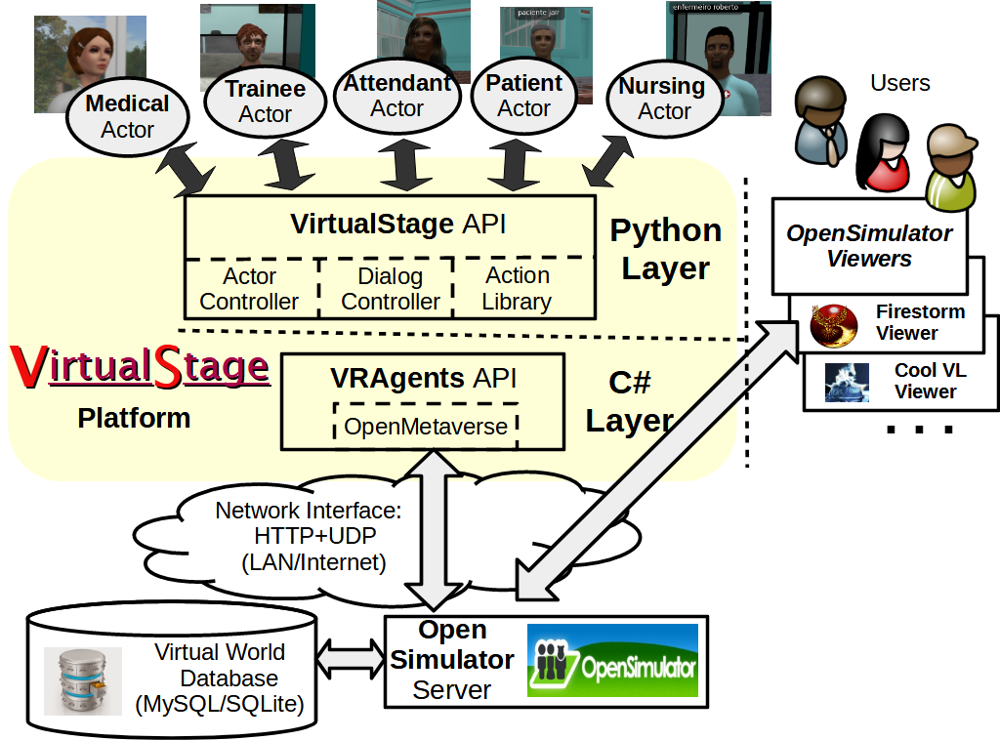

# VirtualStage

## A Virtual Stage for Virtual Actors

***VirtualStage*** is a platform for the design and development of intelligent virtual actors, capable of controlling digital characters (or "Non-Player" Characters - NPCs) that operate in Virtual Reality (VR) worlds or environments.

***VirtualStage*** offers a complete Applications Programming Interface (API) to program and control these digital characters in Python. Using ***VirtualStage*** API it is possible to quickly and easily create VirtualStage "actors" able to play and interpret the most diverse types of digital characters in a VR world. 

In a sense, ***VirtualStage*** API creates a true "virtual stage" for "virtual actors". Analogously to real actors, a ***VirtualStage*** actor must also follow a script to act on the virtual stage and play a digital character. But, in the case of ***VirtualStage***, the scripts that guide the actor's performance are scripts in Python. Using the ***VirtualStage*** API a Python program can implement several actors that play different digital characters on the virtual stage, each of these actors being executed by a separate thread.

The ***VirtualStage*** API is implemented by an extensive library of Python modules and functions designed to manage and control the operation of actors and its scripts. This API provides functions that allow the actor to precisely control the performance of its digital character on the stage or virtual world. 

This API also makes it possible for actors to perform a wide variety of actions on the virtual stage, interact with other characters or avatars, and observe what objects exist and what situations are occurring on the virtual stage. ***VirtualStage*** provides a memory to store and recall information collected and generated by the actor during its performance. 

***VirtualStage*** also implements a Near Natural Language (NNL) dialog system, which supports several forms of conversations and chats between VirtualStage actors and its users (i.e., other avatars and characters).

The main purpose of ***VirtualStage*** is to be a learning tool on how to create and develop VR applications. I hope it has a smoother learning curve than other development tools for VR applications. Its overall goal as a development platform is to make the design and building of prototype VR applications and proof-of-concept systems a little easier and faster. It is not really aimed to develop full production applications. To do this, use professional platforms such as *Unreal* [\[1\]](#ref1) or *Unity* [\[2\]](#ref2).


## Software Architecture

The following figure shows the overall architecture of the ***VirtualStage*** platform:



The **ActorController** module provides functions to manage and control the operation of actors and its scripts. It also provides functions for ***VirtualStage*** actors to communicate with other actors, without depending on VR world simulator for this communication.

The **DialogController** Module implements the Near Natural Language (NNL) dialog system, which supports several forms of conversations and chats between ***VirtualStage*** actors and its users (i.e., other avatars and characters).

The **VirtualStage Actions Library** implement all actions that the actor can perform on VR world. It also implements actions to manage actor's memory and perceptions. This library is composed by the following modules:

- Module **AppearanceActions**: implement actions to view and/or change avatar's appearance.

- Module **CommunicateActions**: implement actions to communicate with other avatars.

- Module **MemoryActions**: implement actions to manage actor's memory.

- Module **ModifyActions**: implement actions to modify objects and entities of VR world.

- Module **MoveActions**: implement actions to move the avatar on VR world.

- Module **ObserveActions**: implement actions to observe object, entities and properties of VR world.

- Module **PerceptActions**: implement actions to manage actor's perceptions.

- Module **PositionActions**: implement actions to view and/or change avatar's positioning and orientation.

- Module **PostureActions**: implement actions to view and/or change avatar's posture and gestures.

- Module **ResourcesActions**: implement actions to view and/or modify resources stored in the avatar's inventory.

- Module **SocialActions**: implement actions for social interaction with     other avatars.

- Module **SystemActions**: implement system actions.

The ***VRAgents*** interface library provide access to OpenSimulator [\[3\]](#ref3) VR simulators. This library is written in C# and implements an actions/perceptions abstraction layer on top of *LibOpenMetaverse* [\[4\]](#ref4) library, providing a API, which allow agents (and ***VirtualStage*** actors) to interact with VR entities or objects through high-level actions, and register high-level perceptions about observed entities or objects.


## Installing

Currently ***VirtualStage*** only runs on Windows, I've tested it on Windows 10 and Windows 11. I hope I can generate a Linux version, but for now I haven't had the time.

***VirtualStage*** is distributed mainly in source form, so to install it download the source code from repository and unpack it in `VirtualStage` directory, for instance `C:\VirtualStage`.

The `VirtualStage\VRAgents` directory contains the source code of ***VRAgents*** interface library, which provide access to OpenSimulator [\[3\]](#ref3) VR simulators. A precompiled ***VRAgents*** library is distributed on `VirtualStage\bin` directory, but if necessary this library can be recompiled using VisualStudio solution file `VirtualStage\VRAgents\VRAgents.sln`.

For ***VRAgents*** and ***VirtualStage*** to run it is necessary to have *.NET Framework* 4.8 installed. 

VirtualStage also needs Python 3.8.2 because newer versions of Python (at least to version 3.10, which I have tested) have compatibility issues with version 2.5.2 of the *pythonnet* package (this package is needed to access ***VRAgents*** library, which is written in C#). 

So first download the appropriate installer for your computer (usually the 64-bit version), run it and install Python 3.8.2.

After installing Python, install the following Python packages:

- *pythonnet* package: this package supports the interface to C# modules and libraries required to use ***VRAgents*** library. The version 2.5.2 of this package must be installed. The *PythonNet* package is used with the `clr` namespace, so after installing this package it must be imported in programs thar will use VirtualStage using the directive:
 
	`import clr`

- *nltk* package: this package provides tools for natural language processing. To install it run the following command in Windows terminal:

	`pip install nltk`
	
After installing this package it is necessary to download the 'punkt' tokenization model used in nltk. This is done with the following commands executed inside the Python console:

    >>> import nltk
    >>> nltk.download('punkt')

- *python-aiml* package: this package implements an AIML interpreter in Python. To install it run the following command in Windows terminal:

	`pip install python-aiml`


## Running

The **ActorController** module provides functions to manage and control the operation of actors and its scripts. It is the main module of ***VirtualStage*** and provides access not only to the functions that control actor's operation, but also to the **VirtualStage Actions Library**. This module must be imported by all Python programs that use ***VirtualStage***:

    import ActorController as ac

The operation (performance) of some actor is started by calling the following function:
 
    start_actor(first_name, last_name, password, vr_server_url, start_loc=None, 
        init_script=None, extra_args=None)        

This function tries to connect with an *OpenSimulator* [\[3\]](#ref3) VR simulator located in *vr_server_url* web address, logging in the avatar with name and password defined, resp., by *first_name*, *last_name* and *password* args. If the login is successful, this avatar will be the digital character or NPC controlled by the ***VirtualStage*** actor in the VR world. 

After a successful login, the *start_actor*() function begins actor's performance by running the initial script of actor (as defined by *init_script* argument) in a new Python thread. If everything goes well, then *start_actor*() returns the actor's "*acid*" to the calling function, which is a string with the actor's unique universal ID (UUID) that must be used when calling other functions of ***VirtualStage*** API. However, if some problem occur, this function returns None.

All ***VirtualStage*** actors begin their performances by running an initial script, which is implemented by the Python function passed to *start_actor*() as the *init_script* argument. This argument is a reference a callable Python function with the following arguments:

    acid: a string with the unique global identifier of new actor.    
    acname: the name of new actor.    
    extra_args: tuple with additional arguments.

**Note**: for debugging and testing purposes, the *init_script* argument can be None. In this case, the function and the Python thread were this function isrunning will be the initial script and thread of the actor. This tipically is the Python console and by doing this is possible to call VirtualStage API functions directly from the console.

When the initial script function terminates and return, this only finish the corresponding Python thread. To logout the avatar controlled by this actor from VR world and end actor's operation in this world is necessary to call the function: 

    stop_actor(acid)

The **DialogController** Module implements the Near Natural Language (NNL) dialog system, which supports several forms of conversations and chats between ***VirtualStage*** actors and its users (i.e., other avatars and characters).

The NNL dialog system provides several dialog processors to handle the interactions or conversations between the actor and users: 

- Main intent processor: this processor tries to identify an intention on the input string and execute the corresponding intent function, which the actor's handling of user intention. 
        
- Hear-talk rules processor: the dialog system handle "hear and talk" production rules that map token patterns found on input text into output text messages. 

- AIML rules interpreter: an AIML interpreter can be configured to work integrated with NNL dialog system.

To use NNL dialog system in some program, it is necessary to import this module:

    import DialogController as dc

To start NNL dialog system, first is necessary to configure its main processor using functions:

	set_dialog_patterns_file(acid, pattsfile)
	set_dialog_intents_file(acid, intentsfile)

If hear-talk processor or AIML interpreter are used, they must be configured by functions:

	set_dialog_hear_talk_rules_file(acid, prodrulesfile)
	set_dialog_aiml_files(acid, aimlfiles)

Then the dialog system is initialized calling the function:

	init_dialog_system(acid)
        
The user input is processed by NNL dialog system by calling the function:

	process_dialog_input(acid, username, userinput)
            
This function has the following arguments: 

	acid: is a string with the unique ID of the VirtualStage actor 
    username:  is the name of the user that sent the input
   	userinput: is a string with the text entered by the user
        
If some dialog processor was succesful in handling the input, then this function returns an string of text that can be sent back to user. Otherwise, this function returns None.

The following code shows an example of a simple actor, the **ChatterActor**, which is distributed with ***VirtualStage***:

```
import ActorController as ac
import DialogController as dc
stop_chatter_actor=False
def main_script(acid,actorname,x,y):
    global stop_chatter_actor
    # Some memories to remember about me 
    ac.record(acid,['character-name','Chatter VRBot'])
    ac.record(acid,['character-age','1'])
    ac.record(acid,['character-gender','robot'])
    # Initialization of dialog manager    
    dc.set_dialog_patterns_file(acid,'ChatterPatterns.json')
    dc.set_dialog_intents_file(acid,'ChatterIntents')
    dc.set_dialog_aiml_files(acid,['aiml\\standard-bot\\std-*.aiml'])
    dc.init_dialog_system(acid)
    # Teleporting to initial position x and y
    ac.tele_to(acid,x,y)
    # Saying hello to everyone
    ac.say(acid,'Hello everyone, everything good?')
    # Main interaction loop
    while (not stop_chatter_actor):
        # Wait for chat msg not sent by me (max 5 secs)
        msg = ac.wait_chat_msg(acid,'!'+actorname,None,5) 
        if (msg==None): 
            continue # No message received, return to loop
        resp=None
        try: # Process input by dialog system            
            resp = ac.process_dialog_input(acid,msg[1],msg[2])
        except Exception as e:
            print('Chat error: ',e)
        if resp!=None:
            # Something to say, according to dialog system 
            ac.say(acid,resp) 
    ac.stop_actor(acid)

def stop():
    global stop_chatter_actor
    stop_chatter_actor=True
    
def start():
    return ac.start_actor("Chatter","Actor","actor", [],
             "http://127.0.0.1:9000", main_script,(128.0,128.0))
```


## Remarks

The current version of **VirtualStage** (and its C# counterpart, the **VRAgents** library) is 0.7.0. 

I am using this version number now because versions 0.5 and 0.6 of this software had already been used with some degree of success by two undergraduate classes, in 2021 and 2022, to design and develop some small and simple virtual worlds, but with the support of intelligent actors, aimed at Health Education. 

However, despite having been reasonably tested, this software certainly still has a number of bugs, so use it with care. 

The **TestActor** agent, included in the ***VirtualStage*** distribution, can be used to test several features of ***VirtualStage*** API. The **TestActor** agent does not cover all function of this API, but cover a significative subset of it. This actor is continuously being evolved to incorporate the tests of more functions and features of ***VirtualStage***.

***VirtualStage*** was based on a previous plataform, the **VirtuaLog** platform that provided access to *OpenSimulator* VR worlds by programs written in Prolog. Using **VirtuaLog** we created VR and AR intelligent educational games to help the teaching of History [\[5\]](#ref5) and Biological Sciences and Ecology [\[6\]](#ref6).

I'm a member of the hugely small community of Prolog programmers, and I'm particularly fond of this programming language (it was the second programming language I learned, after Pascal). But Prolog really has a very difficult learning curve and almost zero popularity, which makes using **VirtuaLog** a very hard task. So I took advantage of the Covid-19 pandemic period to bring all **VirtuaLog**'s functionalities and resources to the Python language, creating the ***VirtualStage*** platform in the process. 

I already known that Python is easy to learn and program, and have a very smooth learning curve. But, the development of VirtualStage in Python show me that this language is really a very elegant and full fledge programming language. Furthermore, it is an interpreted language, something it shares with Prolog, and I am a big fan of interpreted languages, particularly for creating experimental prototypes. 

For me, being able to incrementally develop a prototype that implements some idea still not much clear, exploring and testing the computational possibilities of this idea while developing and being able to change the sources at any time without waiting for a long compilation process, it is a very efficient way to use computation for scientific and innovative purposes.

I hope you have same kind of fun using this software!

Happy coding ;)

- João Gluz

## References

<a id="ref1">1. [Epic Games. Unreal Engine site (last access Aug. 2023) ](https://www.unrealengine.com)

<a id="ref2">2. [Unity Technologies. Unity Engine site (last access Aug. 2023) ](https://unity.com/)

<a id="ref3">3. [Open Simulator site (last access Aug. 23023)](http://opensimulator.org)

<a id="ref4">4. [LibOpenMetaverse GitHub page, Release 0.9.3 (last access Aug. 2023)](https://github.com/openmetaversefoundation/libopenmetaverse)

<a id="ref5">5. Baierle, I & Gluz, J. C. Programming Intelligent Embodied Pedagogical Agents to Teach the Beginnings of Industrial Revolution. In: *Int. Conf. on Intelligent Tutoring Systems 
(ITS)*, 2018, Montreal. Procs. of ITS 2018, 2018. 


<a id="ref6">6. Gluz, J.C., Passerino, L.M., Preuss, E., Baierle, I., Cimadevila, M. Ambiente Virtual Tangível para Integração Sensorial no Ensino de Ciências numa Perspectiva Inclusiva. In: *Simpósio Brasileiro de Informática na Educação (SBIE 2018)*, 2018, Fortaleza. Anais do SBIE 2018, 2018.
